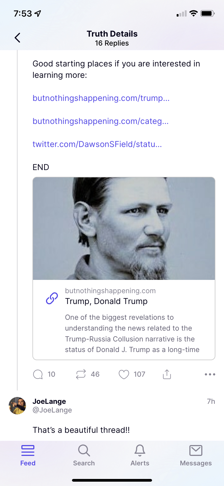

# Trump is Batman

We are in an Information War. The Globalists have a narrative that they want people to believe. So do the Patriots. The Globalist narrative is deceptive in that it hides their true intentions which most people would oppose if they knew the truth. The Patriots narrative is deceptive in that it hides the truth because it could derail the plans to take down the Globalists and too much information too quickly would be too much of a shock to the people. Those who want to know what the truth is beyond the narrative is forced to the fringe, called "conspiracy theorists", and must dig deep to find out what is going on. Theories like Devolution, or the Q plan are plausible to me because there is evidence to support that these things may be true. The idea of Trump being an FBI asset is another of these plausible theories because there is real evidence to support it.

An independent journalist I follow named Kyle who goes by the handle "Just Human" posted this thread about the possibility of Trump being a FBI asset:

<https://truthsocial.com/@justhuman/posts/108796687035619378>

Here are the links from the post:

<https://rumble.com/v14mg43-judgedoj-denial-of-foia-proves-trump-and-trump-org-are-fbi-assets.html>
<https://butnothingshappening.com/trump-donald-trump/>
<https://butnothingshappening.com/category/fbi-informants/>
<https://twitter.com/DawsonSField/status/1139226046744735749?s=20&t=HcJyIA9RzoMxWVU3KNQ_JQ>

Here are screenshots if you can't access Truth Social:

